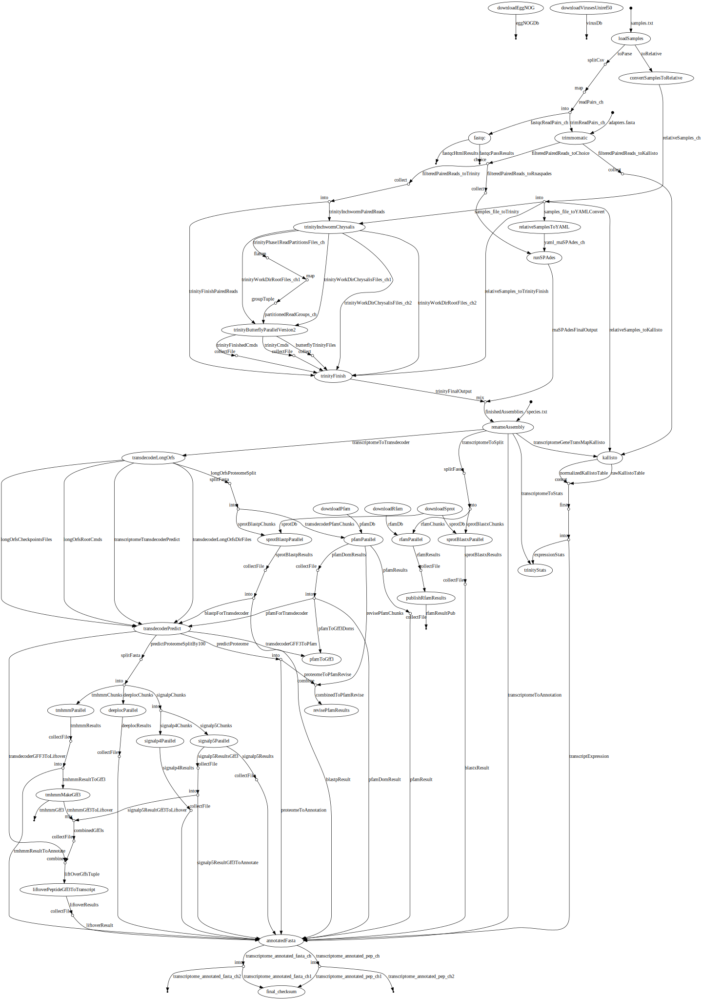

# transXpress-nextflow
transXpress: a [Nextflow](https://www.nextflow.io) pipeline for rapid de novo transcriptome assembly and annotation

Also see our sister project: [transXpress-snakemake](https://github.com/transXpress/transXpress-snakemake)

## Intro

## Dependencies

Requires
* NextFlow 19.01.0+ (install via conda)
* fastqc (install via conda)
* trimmomatic (install via conda)
* Trinity (install via conda)
* SPAdes (install via conda)
* TransDecoder (install via conda)
* BioPython (install via conda)
* samtools (install via conda)
* bowtie2 (install via conda)
* infernal (install via conda)
* HMMER (install via conda)
* kallisto (install via conda)
* NCBI BLAST+ (install via conda)
* R (install via conda)
* seqkit (install via conda)
* basic Linux utitilies: wget, split, awk, cut, gzip

Optional
* [deeploc](http://www.cbs.dtu.dk/cgi-bin/nph-sw_request?deeploc) / [SignalP 4.1](http://www.cbs.dtu.dk/cgi-bin/sw_request?signalp+4.1) / [SignalP 5.0](http://www.cbs.dtu.dk/cgi-bin/nph-sw_request?signalp)
* [tmhmm v. 2.0](http://www.cbs.dtu.dk/services/TMHMM/)

## Installation

1. Install [Miniconda3](https://conda.io/en/latest/miniconda.html)
2. Setup conda environment 
~~~
conda create --name transxpress
conda activate transxpress
~~~
3. Install conda dependencies:  
~~~
 conda config --add channels bioconda
 conda config --add channels conda-forge
 conda config --add channels r
 conda install nextflow fastqc trimmomatic trinity=2.8.5-0 spades transdecoder biopython samtools bowtie2 infernal hmmer kallisto blast r=3.6.0 seqkit bioconductor-edger
~~~
(Note, below dependencies are optional, transXpress will run to completion without them, but will produce empty files for their output)

4. Install deeploc (performance being evaluated by transXpress developers in comparison to SingalP 4.1/5.0)
      * Download deeploc from http://www.cbs.dtu.dk/cgi-bin/nph-sw_request?deeploc
      * Install dependencies: `pip install -r requirements.txt`
      * Install deeploc: `python setup.py install` or locally: `python setup.py install --user`
      
5. Install SignalP 4.1g (performance being evaluated by transXpress developers in comparison to SingalP 5.0/deeploc)
      * Download SignalP 4.1g from http://www.cbs.dtu.dk/cgi-bin/sw_request?signalp+4.1


6. Install SignalP 5.0 (performance being evaluated by transXpress developers in comparison to SingalP 4.1/deeploc)
      * Download SignalP 5.0 from http://www.cbs.dtu.dk/cgi-bin/nph-sw_request?signalp
      
7. Install tmhmm
      * Download tmhmm from http://www.cbs.dtu.dk/services/TMHMM/

## Usage
Make your assembly directory and change it to the current directory
```
mkdir your_assembly_directory
cd your_assembly_directory
```
Setup the mandatory 'samples.tsv' file in the assembly directory describing where to find your raw read FASTQ files. Reads will be pooled from all samples for a single transcriptome assembly, but expression quantification will happen on a per-sample basis. See the tests directory for an example of a samples file: [samples.tsv](./tests/test_nonSS-trinity/samples.tsv)

Setup the mandatory 'species.txt' file in the directory describing which species the data comes from. See the tests directory for an example of a species file: [species.txt](./tests/test_nonSS-trinity/species.txt)

Symbolically link the transxpress-nextflow code into your assembly directory
```
ln -s /your/transxpress-nextflow-cloned-directory/* ./
```
Make sure your conda environment has been sourced, and then execute the run.sh script with your assembler of choice, either `trinity` or `rnaspades` currently
```
./run.sh trinity
```
NextFlow only likes 1 assembly per directory, so if you'd like to run two assemblies simultaneously, you have to use different assembly directories.

```
./run.sh trinity strandSpecific_local
```

The 2nd parameter for the ./run.sh wrapper script allows you to specify the profile that is used. The profiles (stored in the `nextflow.config` file) are currently used to configure the execution mode (cluster vs local), and if the assembly is strand specific or not.
```
notStrandSpecific_local
strandSpecific_local
notStrandSpecific_LSF
strandSpecific_LSF
test_notStrandSpecific_local
test_strandSpecific_local
```

## Flow graph


