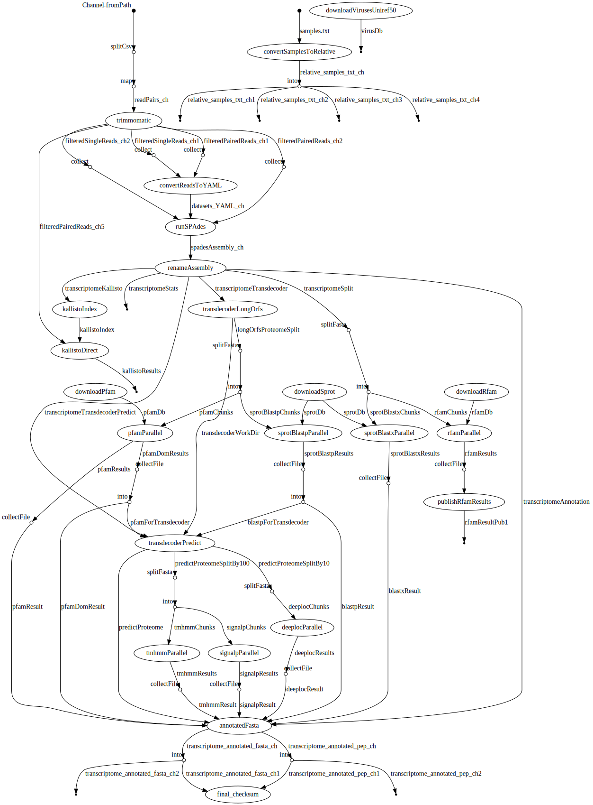

# transXpress-nextflow
transXpress: a Nextflow pipeline for rapid de novo transcriptome assembly and annotation

Also see our sister project: [transXpress-snakemake](https://github.com/transXpress/transXpress-snakemake)

## Intro

## Dependencies

Requires
* NextFlow 19.02.0+
* BioPython
* samtools
* R
* infernal
* seqkit
* basic linux utitilies: wget, split

## Installation


## Usage
Make your assembly directory and change it to the current directory
```
mkdir your_assembly_directory
cd your_assembly_directory
```
Setup the mandatory 'samples.txt' file in the directory. See the tests directory for examples
Setup the mandatory 'species.txt' file in the directory. See the tests directory for examples

Link the transxpress-nextflow content into your assembly directory
```
ln -s /your/transxpress-nextflow-cloned-directory/* ./
```
Execute the run.sh script with your assembler of choice, either trinity or rnaspades currently
```
./run.sh trinity
```

## Flow

**Trinity**


**rnaSPAdes**

